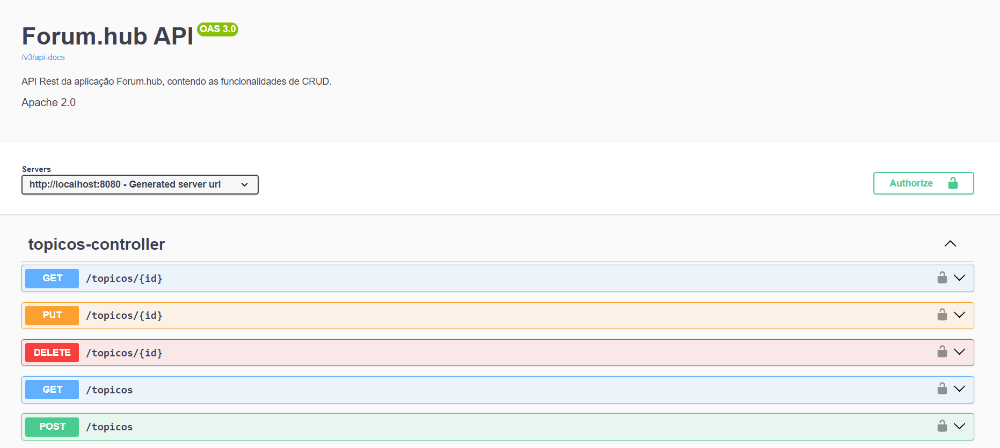

<h1 align="center"> API Forum Hub </h1>

## Índice

* [1. Introdução](#1-introdução)
* [2. Estrutura Geral do Projeto](#2-estrutura-geral-do-projeto)
* [3. Funcionalidades da API](#3-funcionalidades-da-api)
* [4. Guia de Instalação e uso](#4-guia-de-instalação-e-uso)
* [5. Objetivos de Aprendizagem](#5-objetivos-de-aprendizagem)
* [6. Tecnologias Utilizadas](#6-tecnologias-utilizadas)

***

## 1. Introdução🤩

O Fórum Hub foi desenvolvido para atender as necessidades dos usuários participantes de uma plataforma de cursos e estudos, podendo realizar suas perguntas sobre determinados assuntos. Nesta plataforma os alunos utilizam o fórum para tirar suas dúvidas sobre os cursos, desafios e projetos em que estão participando. Esse projeto foi desenvolvido através do desafio proposto pelo programa ONE Oracle Next Education em parceria com a [Alura](https://www.alura.com.br/).

## 2. Estrutura Geral do Projeto📝

### Configurações e Dependências

Dependências do Spring:
* Spring Boot
* DevTools
* Lombok
* Spring Web
* Validation
* MySQL Driver
* Spring Data JPA
* Flyway Migration.

Dependências do Spring Doc:
* OpenAPI

### Pacotes

A aplicação foi organizada em 3 principais pacotes:

* Controller
* Domain
* Infra

No pacote `Controler` temos a classe relacionada ao controlador responsável por fazer as requisições HTTP do sistema. No pacote `Domain` temos a classe relacionada aos Tópicos. E por fim temos o pacote `Infra` que está sendo responsável por lidar com a segurança, exceções e configurações do projeto.

### Documentação da API

Pensando na utilidade da API para equipes de desenvolvimento front-end e mobile, foi aplicado com SpringDoc ao projeto a geração da sua documentação, através da utilização do Swagger para acessar uma interface gráfica, simular requisições e incluir informações de autenticação JWT.

### Segurança

Adicionado o Spring Security ao projeto, implementando uma autenticação e autorização por tokens JWT, sendo configurado para utilizar autenticação stateless e hashing de senhas.

## 3. Funcionalidades da API🔍

* Login: Permite criar um acesso com autenticação dos usuários (email e senha). Os usuários poderão ter acesso as informações do segundo tópico abaixo, seguindo as orientações de validação de token, explicado no `4. Guia de Instalação e Uso`👇
* Cadastro de Tópicos: Permite criar, ler, atualizar, detalhar e deletar informações.

Os testes para consultas, armazenamentos e buscas foram feitos através do Framework Open Source Insomnia.

## 4. Guia de Instalação e Uso📝

* Faça o Fork deste projeto.
* Abra o projeto em alguma IDE da sua escolha.
* Atualize o Maven para garantir que as dependências foram baixadas corretamente.
* Acesse o MySQL com seu nome cadastrado e senha.
* Crie o database forumhub_api no seu MySQL --> (create database forumhub_api;)
* Acesse o database criado.
* Crie um usuário com email e senha. Para criar basta inserir no seu MySQL:
  * insert into usuarios values(1, 'email', 'senha') --> senha hash
  * Recomenda-se que para a criação da senha, seja utilizado um algoritmo de hash de senhas. Para criá-lo, basta utilizar o chatGPT, solicitando que o mesmo crie um hash de senha no formato BCrypt da senha desejada.
  * Ao inserir as informações, aperte ENTER.
  * Saia do MySQL.

* Rode a aplicação.
* Acesse a documentação pelo seu browser (Chrome, Firefox, etc), onde na barra de busca você pode acessar os seguintes links:

  * `http://localhost:8080/v3/api-docs/` - Você terá acesso à um JSON que explica todos os endereços e endpoints da API.
  * `http://localhost:8080/swagger-ui.html` - Você terá acesso à API em uma versão Web.👇

* Realize os testes nessa versão Web. Basta inserir o token gerado ao ser logado e autenticado na API, e realizar as chamadas HTTP.
* Você pode realizar os testes também utilizando as ferramentas do Insomnia e/ou Postman.

## 5. Objetivos de Aprendizagem📝

* Criando uma API do zero com o Spring utilizando recursos e dependências do Spring Initializr.
* Criando classes, DTOs, Records, Interfaces.
* Adicionando funcionalidades, controller e repository.
* Criando migrations com Flyway.
* Trabalhando com CRUD e validações.
* Testando banco de dados com MySQL.

## 6. Tecnologias Utilizadas✅

    
    
    
    
    

